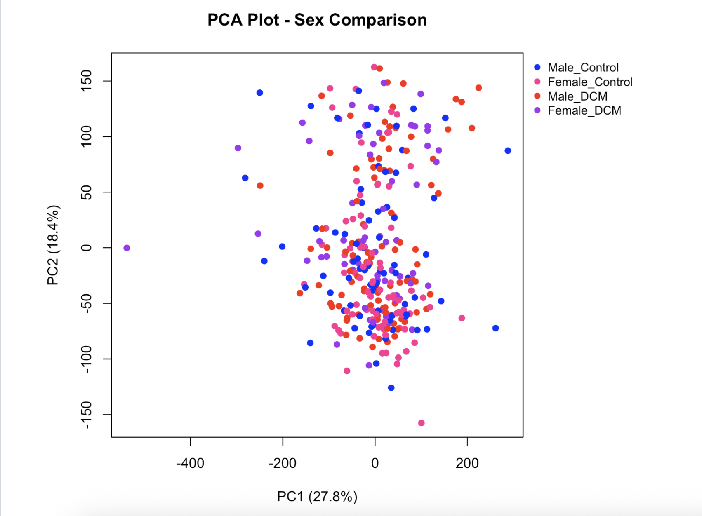
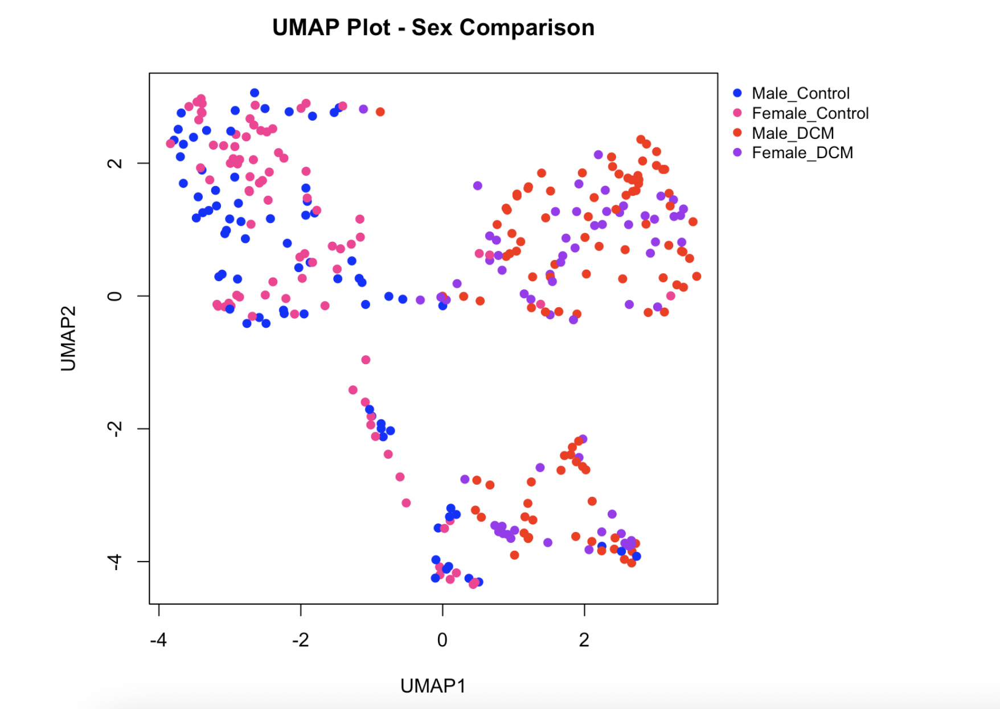
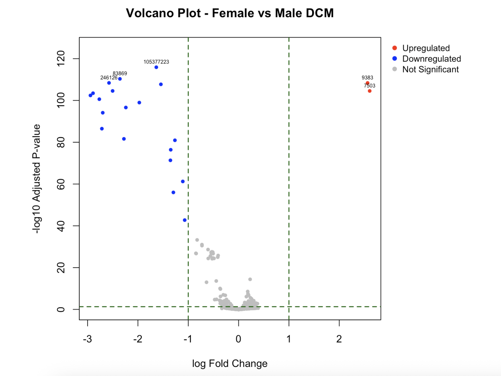
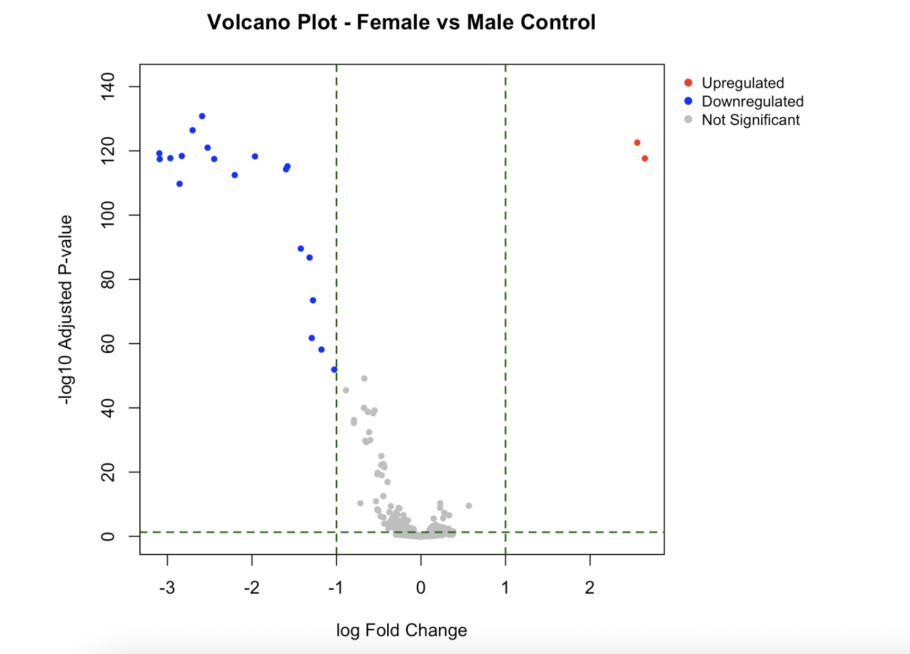
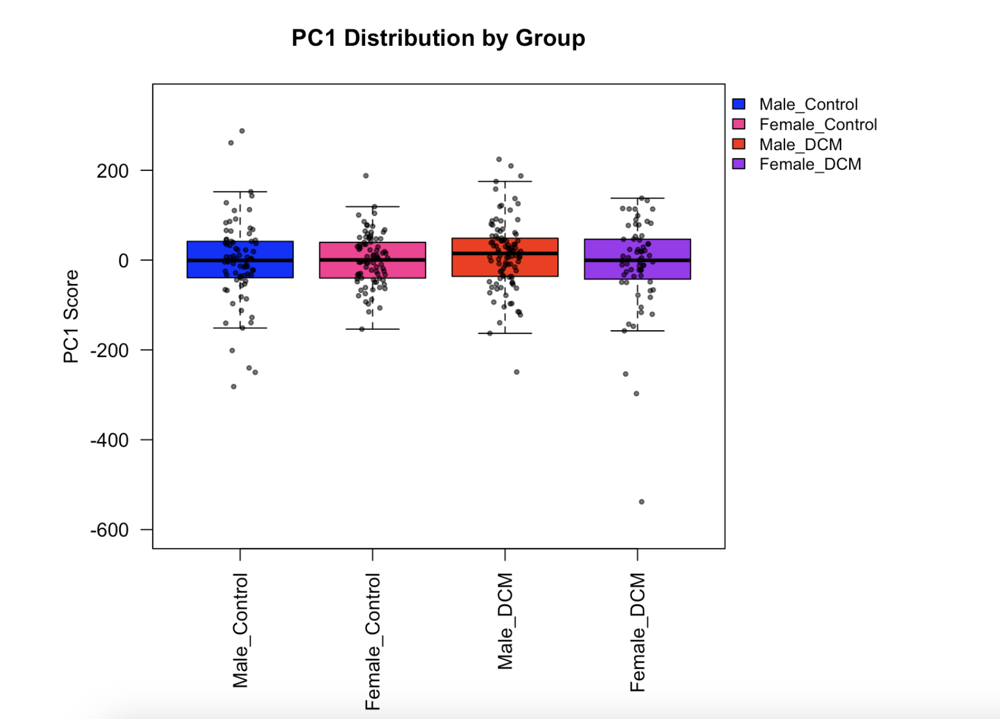

## Introduction

Dilated cardiomyopathy (DCM) is a condition where the heart becomes enlarged and weakened, reducing its ability to pump blood effectively. This can lead to heart failure, arrhythmias, and in severe cases, sudden cardiac death. DCM is one of the leading causes of heart transplantation and can affect individuals at relatively young ages.

The causes of DCM are complex and include genetic mutations, environmental factors, and unknown contributors. Because of this, studying the disease at the molecular level is important for understanding what is actually happening inside the heart.

This project uses RNA-seq data to analyze gene expression changes in DCM compared to non-failing hearts. In addition, this project specifically explores whether these changes differ between males and females.

## Research Question

Which genes and molecular pathways differ between males and females with dilated cardiomyopathy (DCM) compared to non-failing hearts?

## Hypothesis

DCM hearts show distinct gene expression and pathway changes compared to non-failing hearts, with stronger inflammatory and remodeling signals. These effects are expected to differ between males and females.

## Dataset: GSE141910

RNA sequencing of the left ventricle from non-failing donors and heart failure samples from the MAGNet consortium.

Total samples: 305

Non-failing: 152

70 males  
82 females

DCM: 153

92 males  
61 females

GEO Accession: <https://www.ncbi.nlm.nih.gov/geo/query/acc.cgi?acc=GSE141910>

## Methods

The analysis pipeline includes:

- Filtering low-count genes
- Log transformation of counts
- Principal Component Analysis (PCA)
- UMAP clustering
- Differential gene expression using limma
- Volcano plot visualization
- Sex-based comparison of DCM samples
- KEGG pathway enrichment analysis

## Visualizations

### PCA Plot - Sex Comparison

This PCA plot compares control and DCM samples by sex. It shows partial separation between disease groups, but there is still overlap between male and female samples, suggesting that sex-specific differences are present but not dominant.

### UMAP Plot - Sex Comparison

This UMAP plot provides another view of sample clustering. It shows slightly clearer grouping patterns than PCA, which suggests that some nonlinear structure exists in the data, although the groups are still not perfectly separated.

### Volcano Plot - Female vs Male DCM

This volcano plot highlights genes that differ significantly between female and male DCM samples. It suggests that sex-specific gene expression differences are present in diseased hearts.

### Volcano Plot - Female vs Male Control

This volcano plot compares female and male control samples. Fewer gene differences are seen here compared to the DCM comparison, suggesting that sex effects are more noticeable in disease than in healthy tissue.

### PC1 Distribution

This plot shows the distribution of PC1 values by group. It helps summarize how much of the major variation in the dataset is associated with differences between controls and DCM samples.

##  KEGG Pathway Analysis

KEGG enrichment analysis was performed on significantly differentially expressed genes to understand biological pathways involved in sex differences in DCM.

### KEGG Summary Barplot

KEGG

Barplot showing enriched pathways related to inflammation and metabolic processes in male vs female DCM samples.

##  Key Findings

- DCM samples separate clearly from controls in PCA and UMAP
- There are noticeable gene expression differences between male and female DCM hearts
- Several genes are significantly upregulated in DCM
- KEGG analysis highlights pathways related to inflammation and metabolism
- These results suggest sex-specific biological differences in DCM progression

## Discussion

The results from this analysis show that gene expression patterns in DCM differ from non-failing hearts, although the separation is not completely clear. In the PCA plot, there is some overlap between groups, which suggests that disease status is not the only factor influencing gene expression. This makes sense given how complex DCM is and how much variability exists between patients.

The UMAP plot shows slightly clearer clustering compared to PCA, which suggests that there may be nonlinear patterns in the data that PCA is not capturing as well. Even so, the groups are still not perfectly separated, reinforcing the idea that multiple factors are contributing to the observed variation.

The differential expression results highlight genes that are upregulated and downregulated in DCM. Many of these genes are likely involved in processes such as inflammation and cardiac remodeling, which are commonly associated with heart failure. This aligns with what is already known about the disease.

There also appear to be differences between male and female samples, although these differences are not extremely distinct. This suggests that sex may play a role in how DCM develops or progresses, but it is probably not the only factor. More focused analysis would be needed to better understand these differences.

Overall, the results suggest that DCM is associated with measurable changes in gene expression, but the patterns are complex and not driven by a single variable. This highlights the importance of considering multiple biological and clinical factors when studying the disease.

## Tools Used

- R
- GEOquery
- limma
- clusterProfiler
- org.Hs.eg.db
- umap
- data.table

## Limitations

- This analysis uses bulk RNA-seq data, so it doesn’t tell us which specific cell types the gene expression changes are coming from
- There is a lot of variability between patients (like disease stage or treatment history), and that isn’t fully accounted for here
- The sample sizes between groups aren’t perfectly balanced, which could affect some of the comparisons
- All results are based on a single dataset, so they would need to be validated using additional datasets to confirm the findings

## Conclusion

This study demonstrates that DCM is associated with meaningful transcriptomic changes, particularly in pathways related to inflammation and remodeling. The observed sex-specific differences suggest that personalized approaches may be important in understanding and treating the disease.

## Authors

Vaishnavi Madagiri  
Bioinformatics Major — Virginia Commonwealth University

Ammar Mohiuddin  
Biology and Bioinformatics — Virginia Commonwealth University

Harrish Ganesh  
Biology and Bioinformatics — Virginia Commonwealth University

Haneia Nemati  
Bioinformatics — Virginia Commonwealth University